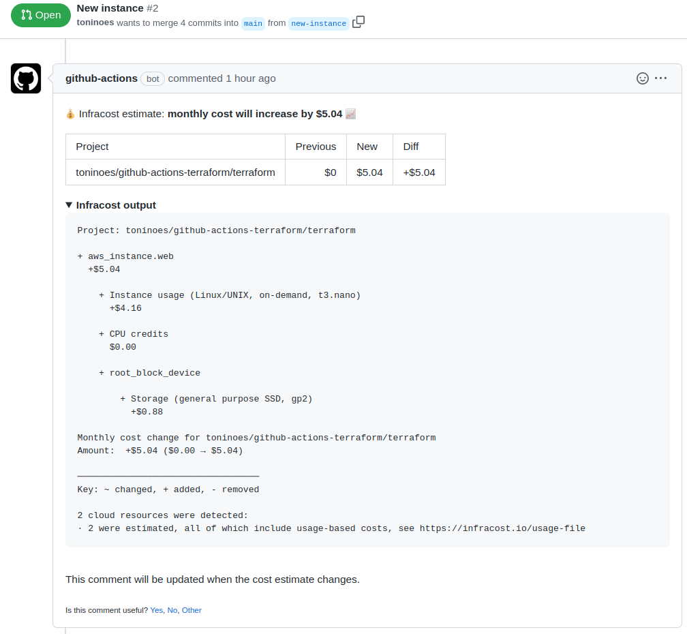
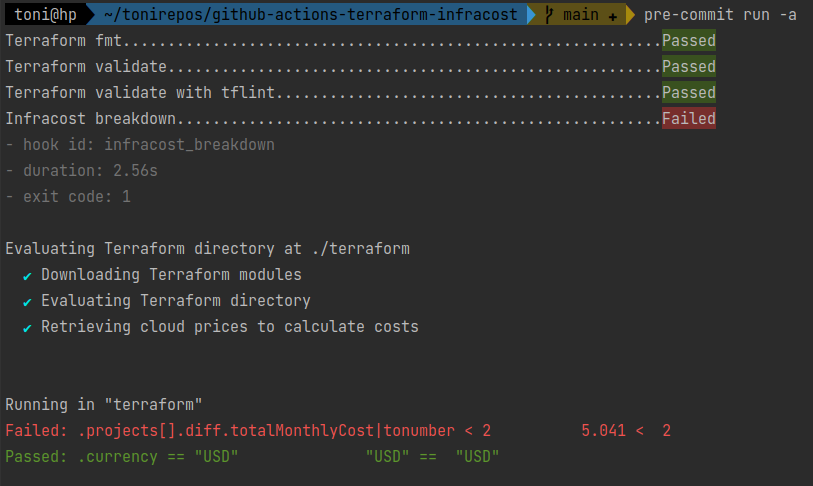

# github-actions-terraform-infracost

This project is made in the context of [flexyfriday](https://www.notion.so/holaluz/FlexyFriday-86c67ad70bcc4e339b87d43a31d7ade7#8fc3ec22a0d6430581bc3333ed2cc4ac) with [@SoyTecnopata](https://github.com/SoyTecnopata) in order to evaluate [Infracost](https://www.infracost.io/) tool with Github Actions.

Once your [infracost workflow](https://github.com/toninoes/github-actions-terraform-infracost/blob/main/.github/workflows/infracost.yaml) is configured, when doing PR, you can get a nice comment like below



Also, you can use locally in [pre-commit](https://github.com/antonbabenko/pre-commit-terraform#infracost_breakdown) and add infracost hook, with costs checks, and for example with this configuration:

```yaml
    - id: infracost_breakdown
      args:
        - --args=--path=./terraform
        - --args=--terraform-var-file="terraform.tfvars"
        - --hook-config='.projects[].diff.totalMonthlyCost|tonumber < 2'
        - --hook-config='.currency == "USD"'
      verbose: true # Always show costs
```

will Fail


